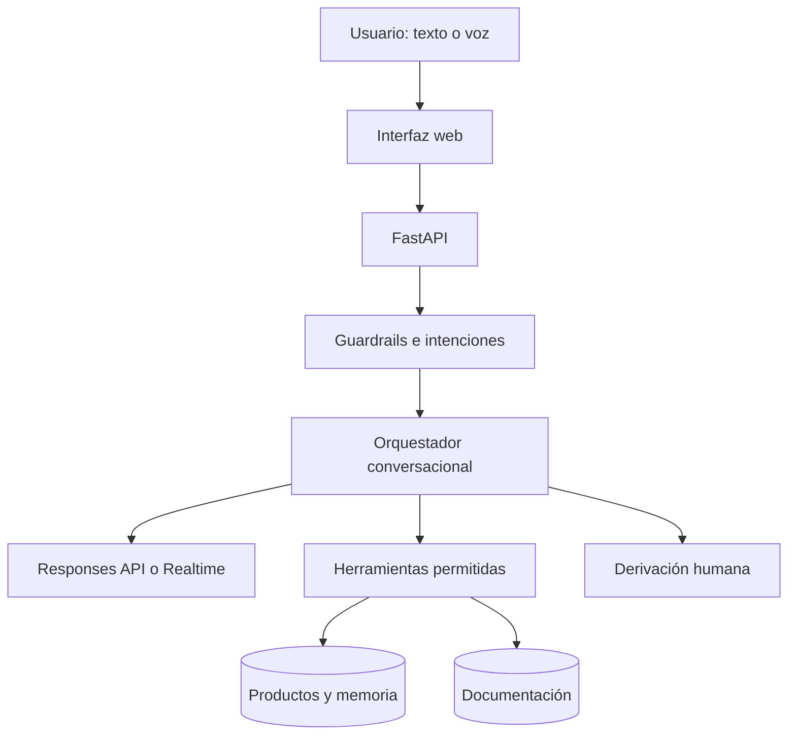

# Arquitectura

## Objetivo

FerreBot separa la interfaz, la conversación, las herramientas y los datos. El
modelo puede proponer una acción, pero no obtiene acceso directo a MySQL.

## Texto

1. FastAPI recibe un mensaje.
2. El guardrail revisa tamaño, inyección y solicitudes de secretos.
3. El clasificador registra la intención.
4. El modo demo aplica reglas determinísticas; el modo OpenAI utiliza Responses
   API y function calling.
5. La allowlist valida la herramienta y Pydantic valida sus argumentos.
6. El backend consulta datos.
7. Se persisten mensaje, herramienta, intención, estado y respuesta.

## Voz

1. El navegador pide un token temporal a FastAPI.
2. FastAPI usa la API key privada y devuelve el secreto temporal.
3. El navegador establece WebRTC directamente con Realtime.
4. Cuando el modelo solicita una función, el navegador reenvía nombre y
   argumentos a `/api/v1/realtime/tool`.
5. FastAPI valida y ejecuta la herramienta.
6. El navegador devuelve el resultado a la sesión mediante
   `function_call_output`.
7. El modelo genera la respuesta hablada.

El navegador coordina eventos, pero no accede a la base de datos ni ejecuta SQL.
Para un entorno comercial de alta seguridad puede agregarse una conexión
complementaria del servidor a la misma sesión.

## Estados

| Estado | Significado |
|---|---|
| `active` | El asistente puede continuar respondiendo |
| `waiting_human` | La conversación fue derivada |
| `closed` | El usuario finalizó la conversación |

## Límites del portfolio

- La búsqueda documental local es lexical y determinística.
- La identidad web es anónima de demostración.
- La modificación de stock y precios queda fuera de las herramientas.
- En producción deben incorporarse autenticación, permisos, rate limiting,
  retención de datos y consentimiento de audio.

